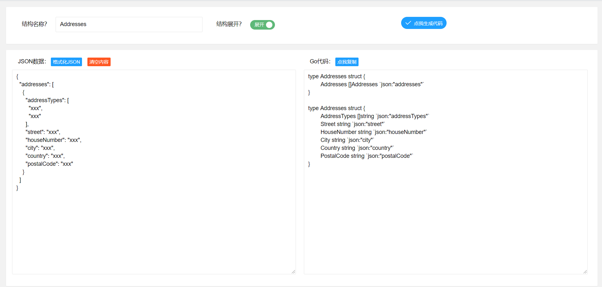
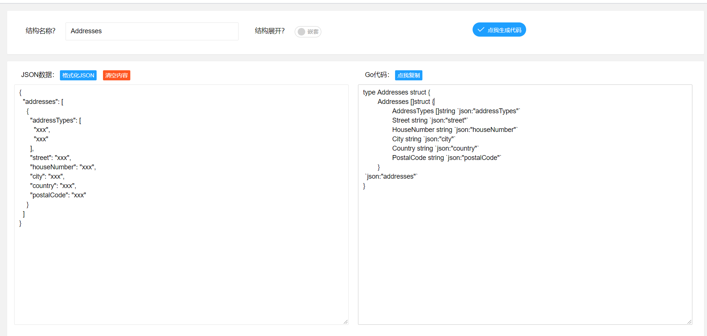
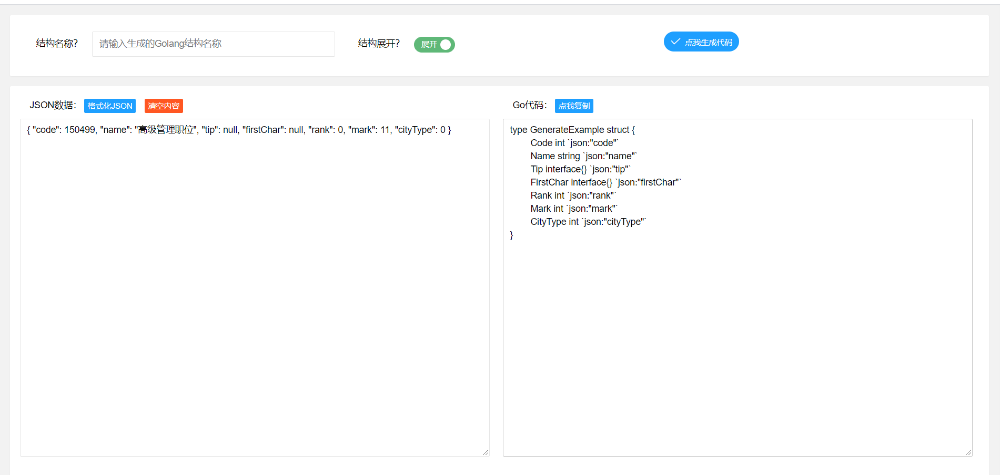
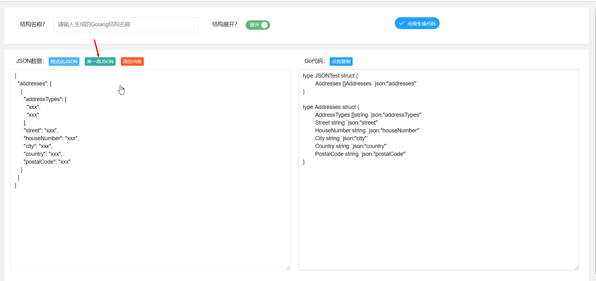

# JSON转Golang工具

  
  
  

## How to use?
生成的Golang代码结构展开：

生成的Golang代码结构不展开：

格式化JSON前：

格式化JSON后(自动复制结果):
.png)

来一串JSON测试：

## 请作者喝咖啡

| 支付宝                                                       | 微信                                                 |
| ------------------------------------------------------------ | ---------------------------------------------------- |
|  |  |
